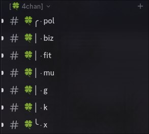

# 4chan Autoposter 
Automatically post 4chan threads with 300 replies to your Telegram Channel or Discord Server. 



Monitors the /pol/ catalog every 5 minutes — any thread with 300+ replies gets mirrored to a Discord webhook and Telegram channel with the OP image and a clean title, comment, and links.

## What it does
- Monitors 4chan /pol/ catalog via the official API
- Posts threads with **300+ replies** to Discord and Telegram
- Attaches OP media — images, GIFs, and WebM/MP4 video
- Generates smart titles from subject or OP comment
- Cold-starts by scanning the archive on first run
- Tracks posted thread IDs in `posted.json` to avoid duplicates

## Setup
1. Create a Discord webhook for your target channel
2. Create a Telegram bot and get your chat ID
3. Fill out `.env`
4. Build and run: `cargo build --release`
5. (Optional) Add a systemd service
```env
POL_WEBHOOK=
TELEGRAM_TOKEN=
TELEGRAM_CHAT_ID=
```
